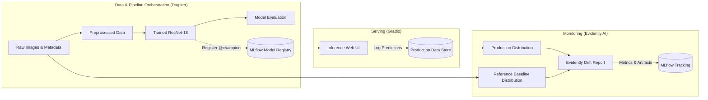

# Plant Biomass Prediction – End-to-End MLOps Pipeline

[](https://www.python.org/)
[](https://pytorch.org/)
[](https://dagster.io/)
[](https://mlflow.org/)
[](https://evidentlyai.com/)
[](https://gradio.app/)

An end-to-end Machine Learning Operations (MLOps) pipeline for predicting plant fresh weight from top-down RGB imagery. The project tracks the full lifecycle from exploratory data analysis and baseline training to pipeline orchestration, model registry management, production serving, and automated statistical data drift monitoring.

---

## Architecture Overview




---

## Repository Structure

* **[`lab-1/`](./lab-1)** – **Baseline Modeling & EDA:** Initial exploratory data analysis, resolution handling, data cleaning, and PyTorch ResNet-18 baseline training.
* **[`lab-2/`](./lab-2)** – **Pipeline Orchestration & Tracking:** Modular pipeline construction using **Dagster** assets, hyperparameter logging, and model artifact tracking with **MLflow**.
* **[`lab-3/`](./lab-3)** – **Model Serving & Drift Monitoring:** Interactive inference web interface built with **Gradio**, continuous inference logging, and production data drift detection using **Evidently**.

---

## Tech Stack

| Domain | Technology |
|---|---|
| **Deep Learning** | PyTorch, Torchvision, Scikit-learn |
| **Pipeline Orchestration** | Dagster, `dagster-mlflow` |
| **Tracking & Registry** | MLflow |
| **Model Serving** | Gradio, MLflow PyFunc |
| **Drift Monitoring** | Evidently AI |
| **Data & Visualization** | Pandas, NumPy, Matplotlib, Seaborn, Pillow |

---

## Quickstart

Clone the repository and inspect the individual modules:

```bash
git clone https://github.com/benginsternas/plant-biomass-mlops.git
cd plant-biomass-mlops
```

For environment setup and execution steps, refer to each module's documentation:
* [Lab 1: Baseline & EDA](./lab-1/README.md)
* [Lab 2: Dagster & MLflow Pipeline](./lab-2/README.md)
* [Lab 3: Serving & Drift Monitoring](./lab-3/README.md)

---

## Context

Coursework for the **MLOps** module at the **Cologne University of Applied Sciences**, taught by **Prof. Dr. Pascal Cerfontaine**.

### Developed by
* **Bengin Sternas**
* **Joshua Sauter**

*(Computer Science and Engineering students at Cologne University of Applied Sciences)*
