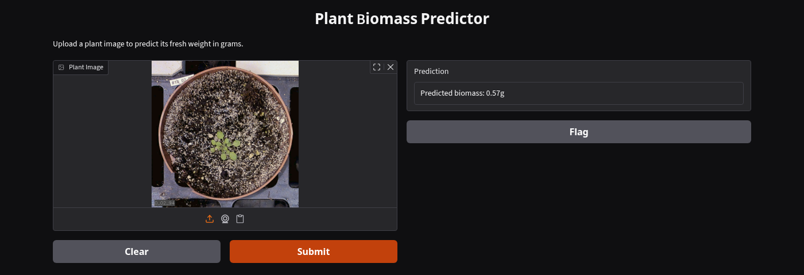
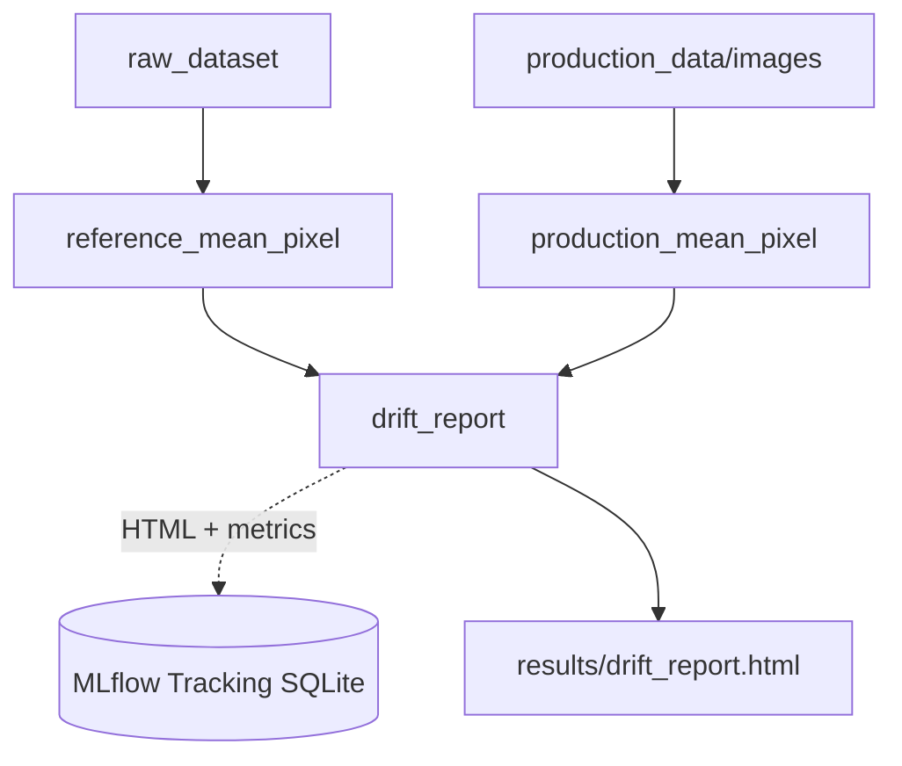
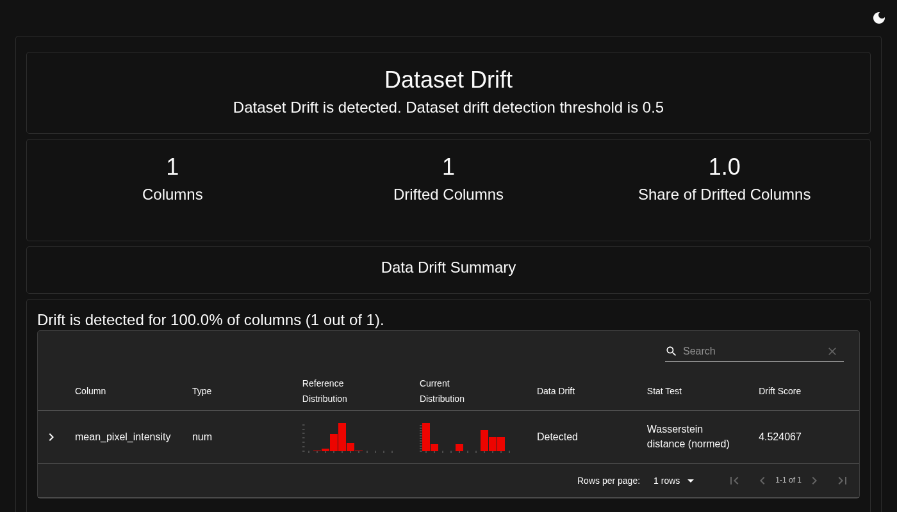

# MLOps Lab Block 3: Model Serving & Data Drift Monitoring
## Plant Biomass Prediction - Group 2

## Overview
This project builds on the Dagster/MLflow pipeline from Praktikum 2 (`MLOps_P2_2`) and adds the missing pieces
for running the model in production: a **Gradio** web app for interactive inference, **production logging** of
every prediction, and **data drift monitoring** with **Evidently** to detect when incoming images no longer
resemble the training data.

## 1. Model Serving (`app.py`)
The trained ResNet-18 model is registered in MLflow under the alias `@champion` (`models:/biomass_resnet@champion`)
and loaded via `mlflow.pyfunc` into a Gradio interface. Users upload a plant image and receive a predicted
fresh weight in grams.

Every inference is logged for later monitoring:
- the uploaded image is saved to `production_data/images/<timestamp>.png`
- the timestamp, image path and prediction are appended to `production_data/logs.csv`


*A plant image is uploaded and scored by the model; the prediction is logged to `production_data/` in the background.*

## 2. Data Drift Monitoring (`dagster_pipeline.py`)
Three new Dagster assets extend the existing training pipeline:

1. **`reference_mean_pixel`**: for every training image (`raw_dataset`), converts it to grayscale and computes the
   mean pixel intensity. This distribution (4294 values) is the reference/baseline.
2. **`production_mean_pixel`**: applies the same computation to every image logged in `production_data/images/`,
   i.e. everything that has actually been sent to the app in production.
3. **`drift_report`**: compares both distributions with Evidently's `DataDriftPreset`, writes an interactive
   HTML report to `results/drift_report.html`, and logs the report plus the drift metrics (`drift_share`,
   `mean_pixel_drift_score`) into the MLflow run created by the `dagster-mlflow` resource (no manual
   `mlflow.start_run()` needed, the resource manages the run lifecycle for every asset in the job).



Mean pixel intensity was chosen as the drift signal because it is cheap to compute, does not require labels
(production images have no ground-truth biomass), and reacts directly to exactly the kind of camera/lighting
problems we simulate below (over-/under-exposure, sensor noise).

## 3. What is Data Drift?
Data drift describes a change in the distribution of the input data a model receives in production compared
to the data it was trained on, while the relationship between inputs and target (if it were known) stays the
same. A model trained on well-lit, correctly oriented top-down plant photos can silently produce unreliable
predictions once, for example, the camera setup changes, lighting conditions shift, or the sensor starts adding
noise - even though nothing about the model itself changed. Because production data is usually unlabeled,
drift monitoring on the *inputs* (as done here) is often the only practical, timely signal that something is
wrong, long before enough labels exist to measure a drop in accuracy directly.

## 4. Drift Detection Results

### 4.1 Baseline: real production images (before simulating a break)
With only the four genuine images logged so far via normal app usage, Evidently still flagged the single
`mean_pixel_intensity` column as drifted (`drift_share = 1.0`, drift score `0.70`). This is expected and worth
calling out explicitly: with a production sample of only 4 images, *any* small distributional difference from
the 4294-image reference is picked up as "drift" - the test has very little statistical power at this sample
size, and a couple of naturally darker/lighter plants are enough to trigger the flag. A single flagged run
should therefore not be over-interpreted; what matters is watching the score over time as more production
images accumulate.

### 4.2 Simulated drift: "broken" images
Eight images were deliberately corrupted to simulate a broken camera pipeline (brightness × 3.5, 90° rotation,
additive Gaussian noise, σ = 40) and submitted through the running Gradio app (via `gradio_client`, i.e. through
the same `predict()` → `log_inference()` path a real user would trigger), so they were logged to
`production_data/` exactly like any other prediction.


*Evidently's Data Drift report after adding the broken images: `mean_pixel_intensity` is flagged as drifted, drift score up almost 6.5x.*

| | Reference (4294 train images) | Production before broken images (n=4) | Production after broken images (n=13) |
|---|---|---|---|
| Mean pixel intensity | 88.6 | 81.8 | ~146 (broken images alone: 145–217) |
| Drift detected | - | Yes (`drift_share = 1.0`) | Yes (`drift_share = 1.0`) |
| Drift score (Wasserstein, normed) | - | 0.70 | **4.52** |

**Effect of the broken images on the score:** the brightness boost dominates the signal - mean pixel intensity
for the broken images (145–217) is roughly 1.6-2.4x the reference mean (88.6), pushing the Wasserstein drift
score from 0.70 to 4.52 (the detection threshold is 0.1, so both states already count as "drift detected", but
the magnitude makes the severity unambiguous). The 90° rotation has no effect on this particular metric since
mean pixel intensity is orientation-invariant; a rotation would only show up in a drift signal that is spatially
aware (e.g. a per-pixel or embedding-based comparison). One production prediction even came out negative
(`-0.02g`), which is itself a symptom of the model extrapolating far outside the input range it was trained on.

## 5. Research: How Does Evidently Pick Its Drift Test?
`DataDriftPreset` does not use a single fixed statistical test - it auto-selects a per-column test based on the
column type and the size of the reference dataset (see `evidently.legacy.calculations.stattests.registry._get_default_stattest`):

- **Numerical column, reference size ≤ 1000 rows:** Kolmogorov-Smirnov test (p-value, threshold `0.05`).
- **Numerical column, reference size > 1000 rows:** Wasserstein distance, normalized by the reference standard
  deviation (threshold `0.1`). This is the branch our pipeline hits, since the reference set has 4294 images.
- **Numerical column with ≤ 5 unique values:** falls back to a chi-squared or z-test (treated as effectively categorical).
- **Categorical columns:** chi-squared/z-test for small reference sets, Jensen-Shannon distance for large ones.

The overall "Dataset Drift" verdict shown at the top of the report (`DriftedColumnsCount`) is a second, separate
rule: a dataset is flagged as drifted if the **share of drifted columns** exceeds a threshold (default `0.5`).
With only one monitored column, that column drifting is enough to flag the whole dataset. Switching from a K-S
p-value on small samples to Wasserstein distance on large ones makes sense: K-S is a hypothesis test that gets
increasingly sensitive to tiny differences as the reference grows, so on a 4294-row reference it would flag
almost any production batch; Wasserstein distance instead measures the *magnitude* of the distributional shift,
which stays interpretable regardless of reference size.

## 6. Technologies
- **Serving:** Gradio, MLflow `pyfunc`
- **Orchestration & Tracking:** Dagster, MLflow, dagster-mlflow
- **Drift Monitoring:** Evidently (`DataDriftPreset`)
- **Machine Learning:** PyTorch, Torchvision

## 7. Setup Instructions
```bash
# Create and activate a virtual environment
python3 -m venv .venv
source .venv/bin/activate

# Install all required packages
pip3 install -r requirements.txt
```

## 8. Running the Project
**Terminal 1: Serve the model**
```bash
python3 app.py
```
Open `http://localhost:7860`, upload a plant image and check that `production_data/logs.csv` gets a new row.

**Terminal 2: Run the pipeline (training + drift monitoring)**
```bash
dagster dev -f dagster_pipeline.py
```
Open `http://localhost:3000`, go to "Lineage" and materialize `raw_dataset`, `reference_mean_pixel`,
`production_mean_pixel` and `drift_report` (training the model via `trained_model`/`model_evaluation` is only
needed if the registered model itself changed). The rendered report is written to `results/drift_report.html`
and also logged as an MLflow artifact.

**Terminal 3: Inspect MLflow**
```bash
mlflow ui --backend-store-uri sqlite:///mlflow.db
```
Open `http://localhost:5000` to see the `drift_share` / `mean_pixel_drift_score` metrics and the attached
`drift_report.html` artifact for each pipeline run.

## 9. Task 3: Validating "No Drift" Detection
Section 4.1 raised an uncomfortable question: even 19 freshly taken, perfectly normal plant photos uploaded
through the running app still got flagged as drifted (`drift_share = 1.0`, Wasserstein score ≈ 0.19), even
though their mean pixel intensity (88.6) matched the reference (88.6) almost exactly. That is not a data
quality problem - it is the statistical test running out of power at small sample sizes.

To confirm this, we drew random samples directly **from the training set itself** (i.e. genuinely non-drifted
by construction, since they come from the same distribution as the reference) at increasing sample sizes and
re-ran `DataDriftPreset` against the remaining images as reference:

| Holdout sample size (n) | Wasserstein score (normed) | Drift flagged? |
|---|---|---|
| 19 | 0.29 | Yes |
| 50 | 0.22 | Yes |
| 100 | 0.13 | Yes |
| 200 | 0.09 | No |
| 250 | 0.06–0.20 (varies by draw) | Usually yes, sometimes no |
| 800 | 0.07 | No |

Even a sample pulled from the *exact same distribution* as the reference needs roughly **150-300+ images**
before the empirical distribution is "smooth" enough for the Wasserstein-normed score to reliably settle below
the `0.1` threshold. Below that, sampling noise alone (a handful of naturally darker/brighter plants) is enough
to push the score over the line - which is exactly what happened with our 4 and 19-image production batches.

**Validation run:** `no_drift_validation.py` draws a held-out sample of 250 real training images (excluded from
the reference calculation for this run only) and treats them as a simulated production batch - the training
labels/model are never involved, this only exercises the drift-detection path. This is a controlled sanity
check, not a live Gradio upload.


*Evidently's Data Drift report for a 250-image holdout sample from the training distribution: `mean_pixel_intensity` is correctly reported as not drifted (Wasserstein score 0.061, well under the 0.1 threshold).*

**Takeaway:** the monitor works correctly in both directions - it flags real distributional shifts (Section 4.2)
and, given enough samples, correctly stays quiet when there is no shift. The practical implication for
production use is that single-digit or low-double-digit upload batches are not a reliable basis for a drift
verdict; the `drift_share`/`drift_score` trend should be read over many accumulated production images rather
than acted on after any one small batch.

## Developers
- Bengin Sternas
- Joshua Sauter
