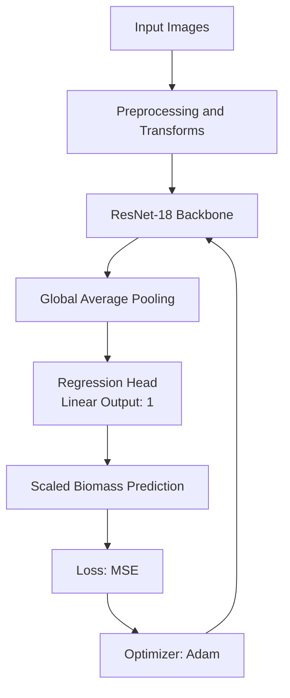

Plant Biomass Prediction - MLOps Praktikum 1 - Gruppe 2

Overview
This project implements an ML pipeline for plant biomass prediction from top-down plant images. It includes EDA, model training in PyTorch, and result logging.

Dataset
- Samples: 4294 images
- Target variable: fresh_weight_total
- Features: temporal and sensor data
- Images: mlops_biomass_data/images_med_res

Exploratory Data Analysis (EDA)

Target distribution
Right-skewed target distribution with many lightweight plants.

Correlation heatmap
Shows relationships between sensor signals and biomass targets.

Biomass vs. age
Biomass increases with plant age, with measurements spaced weekly.

Image pixel analysis
Pixel intensity peaks in darker ranges, indicating soil/background dominance.

Sample images
Visual comparison of plant size and expected biomass.

Data quality
- Missing labels are removed with dropna.
- Targets are scaled to [0, 1] to stabilize MSE training.

Model
- ResNet-18 (ImageNet pre-trained), regression head with 1 output.

Training
- Optimizer: Adam
- Loss: MSE
- Learning rate: 0.0001
- Batch size: 16
- Epochs: 3
- Split: 80/20 (Seed 42)

Technologies
- Python
- PyTorch
- Torchvision
- Scikit-learn
- Pandas
- Matplotlib
- Seaborn
- Pillow
- Git

Architecture Diagram

Results
- Final_Train_Loss: 0.0044
- Final_Val_Loss: 0.0072
- Max_Weight_Scale: 2.113

Reproduction
1. Clone the repo
   - git clone https://gitlab.nt.fh-koeln.de/gitlab/mlops/praktikum/mlops_2/MLOps_P1_2.git
   - cd MLOps_P1_2
2. Setup environment
   - python -m venv .venv
   - source .venv/bin/activate
   - pip install -r requirements.txt
3. Run EDA
   - python eda.py
4. Run training
   - python train_model.py --epochs 3 --lr 0.0001

Developers
- Bengin Sternas
- Joshua Sauter