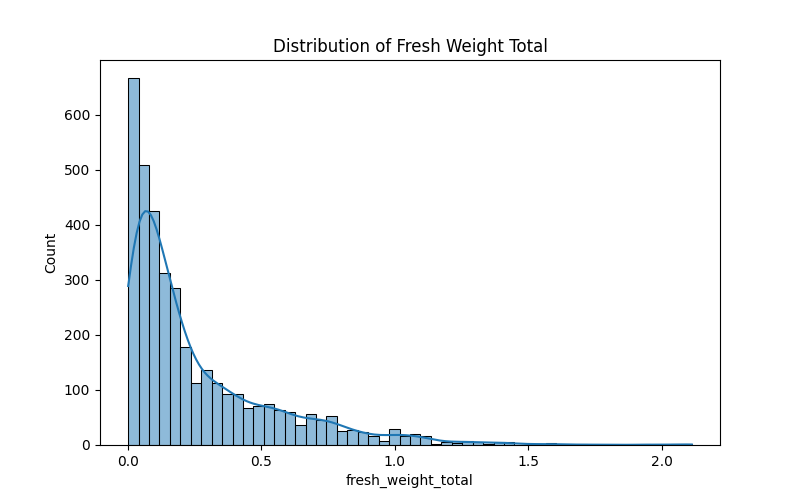
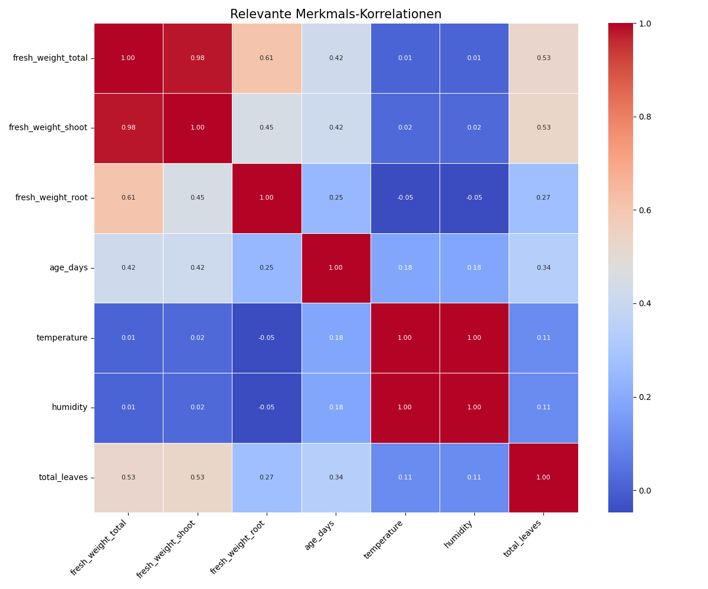
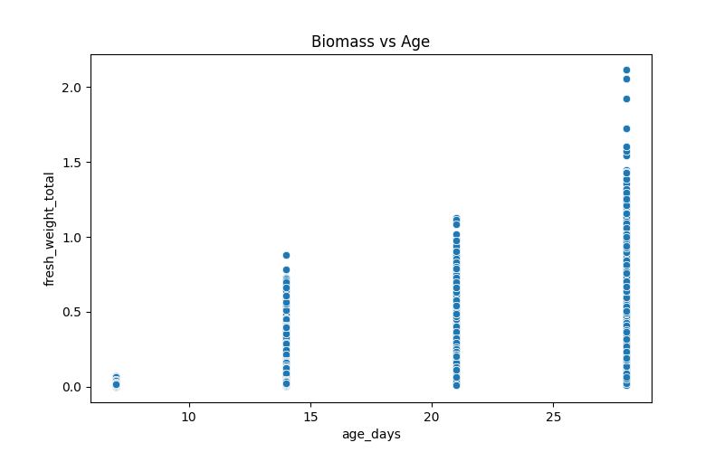
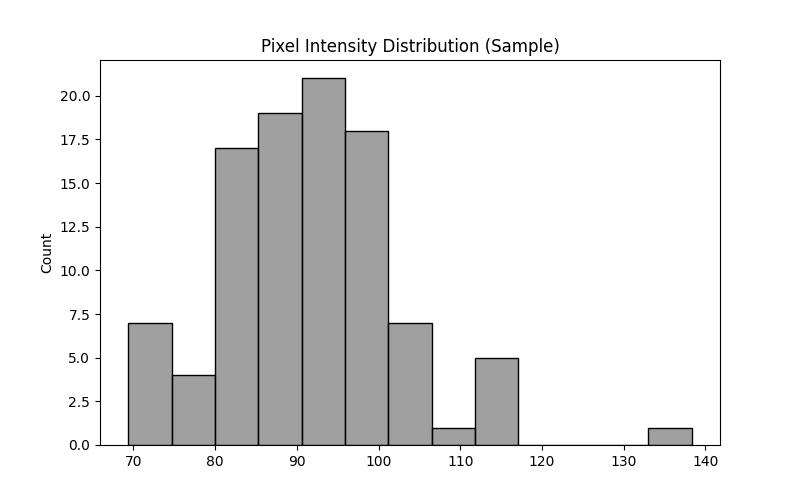
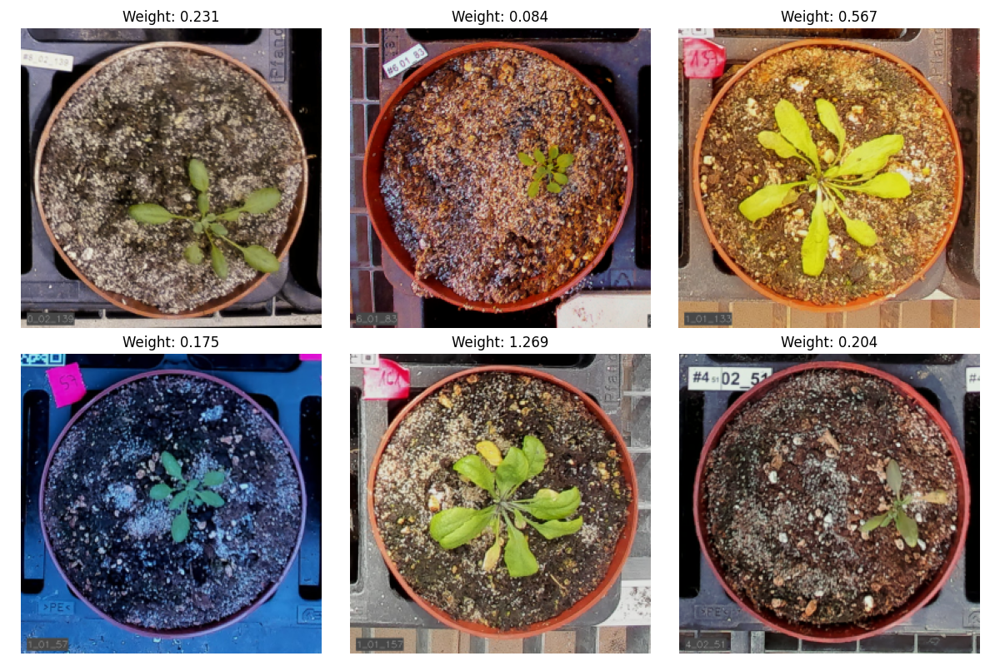
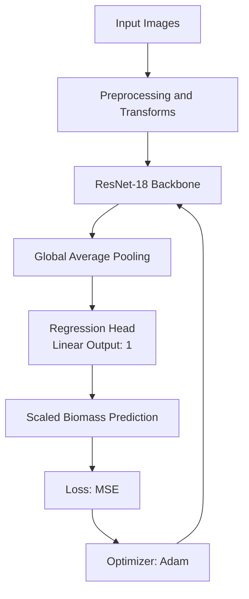
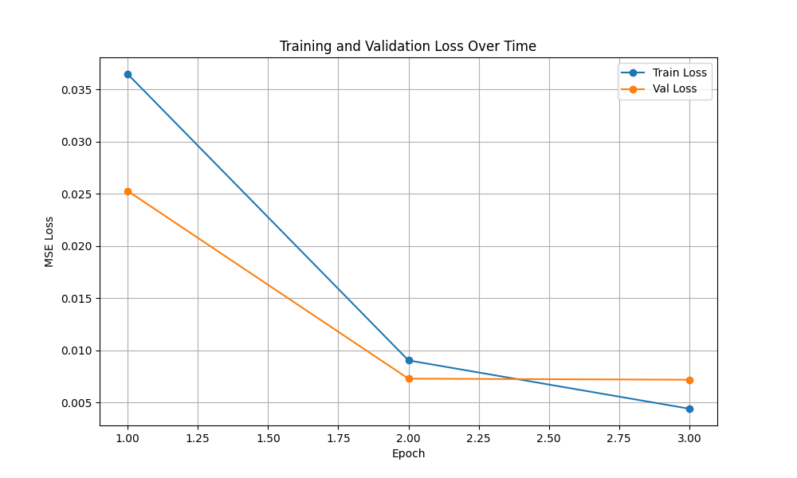

Plant Biomass Prediction - MLOps Praktikum 1 - Gruppe 2

Overview
This project implements an ML pipeline for plant biomass prediction from top-down plant images. It includes EDA, model training in PyTorch, and result logging.

Dataset
- Samples: 4294 images
- Target variable: fresh_weight_total
- Metadata file: digital_biomass_labels.csv (contains sensor/temporal fields and labels)
- Features available: temporal and sensor data (not used for training; images only)
- Images: mlops_biomass_data/images_med_res

Exploratory Data Analysis (EDA)

Target distribution
Right-skewed target distribution with many lightweight plants.

Explanation: The distribution indicates many early-growth plants and fewer heavy samples.

Correlation heatmap
Shows relationships between sensor signals and biomass targets.

Explanation: Strong correlations highlight which metadata aligns with fresh_weight_total.

Biomass vs. age
Biomass increases with plant age, with measurements spaced weekly.

Explanation: The upward trend reflects growth over time.

Image pixel analysis
Pixel intensity peaks in darker ranges, indicating soil/background dominance.

Explanation: Darker pixels suggest background/soil occupies large image areas.

Sample images
Visual comparison of plant size and expected biomass.

Explanation: Larger leaf area visually matches higher biomass values.

Data quality
Issues identified (with examples)
- Missing labels in fresh_weight_total are removed with dropna to avoid invalid samples (rows with empty labels).
- Target scale caused unstable loss (NaN) in early runs. Targets are scaled to [0, 1] by dividing by the max value.

Model
- ResNet-18 (ImageNet pre-trained), regression head with 1 output.

Training
- Optimizer: Adam
- Loss: MSE
- Learning rate: 0.0001
- Batch size: 16
- Epochs: 3
- Split: 80/20 (Seed 42)

Technologies
- Python
- PyTorch
- Torchvision
- Scikit-learn
- Pandas
- Matplotlib
- Seaborn
- Pillow
- Git

Architecture Diagram

Results
- Final_Train_Loss: 0.0044
- Final_Val_Loss (MSE validation metric): 0.0072
- Max_Weight_Scale: 2.113

Training curves

Explanation: Train and validation loss decrease across epochs without divergence.

Challenges
- NaN loss during early runs due to unscaled target values.
- Limited sample size increases overfitting risk for deeper models.

Potential improvements
- Add augmentation (RandomRotate90, ColorJitter) to improve robustness.
- Evaluate ViT-based backbones for long-range leaf context.

Changes
- README: added figures and PDF export.
- Correlation heatmap: focused on fresh_weight_total for a clearer overview.
- Image pixel analysis: switched to RGB distribution for better interpretability.
- Sample images: selected diverse samples to show different growth stages.
- Training: reduced learning rate to make loss curves more detailed (slower convergence).
- Model choice: ResNet-18 preferred over ResNet-50 to reduce overfitting on limited samples.

Reproduction
1. Clone the repo
   - git clone https://gitlab.nt.fh-koeln.de/gitlab/mlops/praktikum/mlops_2/MLOps_P1_2.git
   - cd MLOps_P1_2
2. Setup environment
   - python -m venv .venv
   - source .venv/bin/activate
   - pip install -r requirements.txt
3. Run EDA
   - python eda.py
4. Run training
   - python train_model.py --epochs 3 --lr 0.0001

Developers
- Bengin Sternas
- Joshua Sauter