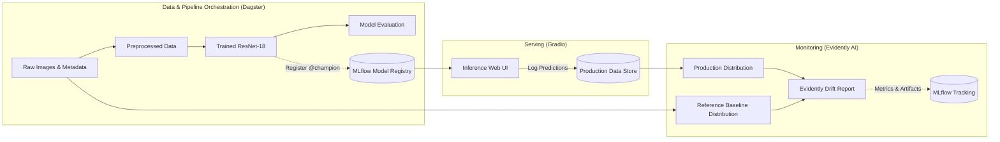

# Plant Biomass Prediction – End-to-End MLOps Pipeline

[](https://www.python.org/)
[](https://pytorch.org/)
[](https://dagster.io/)
[](https://mlflow.org/)
[](https://evidentlyai.com/)
[](https://gradio.app/)

An end-to-end Machine Learning Operations (MLOps) pipeline for predicting plant fresh weight from top-down RGB imagery. The project tracks the full lifecycle from exploratory data analysis and baseline training to pipeline orchestration, model registry management, production serving, and automated statistical data drift monitoring.

---

## Architecture Overview




---

## Repository Structure

* **[`lab-1/`](./lab-1)** – **Baseline Modeling & EDA:** Initial exploratory data analysis, resolution handling, data cleaning, and PyTorch ResNet-18 baseline training.
* **[`lab-2/`](./lab-2)** – **Pipeline Orchestration & Tracking:** Modular pipeline construction using **Dagster** assets, hyperparameter logging, and model artifact tracking with **MLflow**.
* **[`lab-3/`](./lab-3)** – **Model Serving & Drift Monitoring:** Interactive inference web interface built with **Gradio**, continuous inference logging, and production data drift detection using **Evidently**.

---

## Tech Stack

| Domain | Technology |
|---|---|
| **Deep Learning** | PyTorch, Torchvision, Scikit-learn |
| **Pipeline Orchestration** | Dagster, `dagster-mlflow` |
| **Tracking & Registry** | MLflow |
| **Model Serving** | Gradio, MLflow PyFunc |
| **Drift Monitoring** | Evidently AI |
| **Data & Visualization** | Pandas, NumPy, Matplotlib, Seaborn, Pillow |

---

## Tool Usage

Which tools are used in which lab, and to what extent. **Core** tools carry a lab's main deliverable, **supporting** tools are used throughout without being the focus, and **minor** tools serve a single, narrow purpose.

| Tool | Labs | Extent | Scope of use |
|---|---|---|---|
| **PyTorch / Torchvision** | 1, 2, 3 | Core | ResNet-18 with ImageNet weights and a single-output regression head; custom `Dataset`/`DataLoader`, Adam + MSE training loop, automatic device selection (CUDA / MPS / CPU). Torchvision provides the pretrained backbone and the preprocessing transforms (resize to 224×224, ImageNet normalization). |
| **Dagster** | 2, 3 | Core | Pipeline built from software-defined assets: 4 in Lab 2 (`raw_dataset` → `preprocessed_data` → `trained_model` → `model_evaluation`), 8 in Lab 3 (adds `champion_model` and the three drift assets). Uses typed run configs (`Config`), asset logging and output metadata (metrics, inline loss plot, links). Assets are materialized manually from the Dagster UI; schedules, sensors and partitions are not used. |
| **MLflow** | 2, 3 | Core | Tracking with a local SQLite backend (`mlflow.db`): parameters, per-epoch metrics, loss-curve figures. Lab 2 logs the model with `mlflow.pytorch`; Lab 3 switches to a custom `pyfunc` wrapper (`training_utils/wrapper.py`), registers it as `biomass_resnet` in the Model Registry and assigns the aliases `@champion` / `@challenger`. Also stores the Evidently drift report and drift metrics. |
| **Gradio** | 3 | Core | `gr.Blocks` web UI (`app.py`): dropdown of registered model versions and their aliases (read from the MLflow registry), multi-image upload, optional ground-truth field, predictions table. Every prediction is logged to `production_data/`, or to `production_data_measured/` if a ground-truth value is entered. `gradio_client` was used to push the corrupted test images through the running app. |
| **Evidently AI** | 3 | Core | `Report` with `DataDriftPreset` on a single feature, the mean grayscale pixel intensity per image (reference: training set, current: logged production images). Writes HTML reports to `results/`; `no_drift_validation.py` reuses it as a true-negative check. The Evidently workspace/UI is not used. |
| **dagster-mlflow** | 2, 3 | Supporting | `mlflow_tracking` resource that manages one MLflow run per pipeline run, so assets log without calling `mlflow.start_run()`. |
| **Pandas** (+ openpyxl) | 1, 2, 3 | Supporting | Loading the label file (CSV, XLSX fallback via openpyxl), dropping missing labels, merging production data for retraining (Lab 3), feature tables for Evidently. |
| **Matplotlib** | 1, 2, 3 | Supporting | EDA figures and train/validation loss curves, saved to disk and logged to MLflow and Dagster. |
| **Pillow** | 1, 2, 3 | Supporting | Image loading and conversion; in Lab 3 also brightness manipulation (`ImageEnhance`) to simulate drifted camera images. |
| **Git** | 1, 2, 3 | Supporting | Version control (one repository per lab, later merged into this monorepo). Lab 1 writes the current commit hash to `training.log` to tie each training run to a code version. |
| **Scikit-learn** | 1, 2, 3 | Minor | Only `train_test_split` (80/20, seed 42). |
| **NumPy** | 1, 3 | Minor | Per-channel RGB means in the EDA; mean pixel intensity and random holdout sampling for the drift checks. |
| **Seaborn** | 1 | Minor | EDA plots only: target histogram, RGB density plot, biomass-vs-age scatter, correlation heatmap. |
| **Mermaid** | 1, 2, 3 | Minor | Architecture diagrams in the READMEs. In Lab 3, `render_readme_pdf.py` renders the README and its diagrams to `README.pdf` using mermaid-cli, mistune and headless Chromium. |

---

## Quickstart

Clone the repository and inspect the individual modules:

```bash
git clone https://github.com/benginsternas/plant-biomass-mlops.git
cd plant-biomass-mlops
```

For environment setup and execution steps, refer to each module's documentation:
* [Lab 1: Baseline & EDA](./lab-1/README.md)
* [Lab 2: Dagster & MLflow Pipeline](./lab-2/README.md)
* [Lab 3: Serving & Drift Monitoring](./lab-3/README.md)

---

## Context

Coursework for the **MLOps** module at the **Cologne University of Applied Sciences**, taught by **Prof. Dr. Pascal Cerfontaine**.

### Developed by
* **Bengin Sternas**
* **Joshua Sauter**

*(Computer Science and Engineering students at Cologne University of Applied Sciences)*
