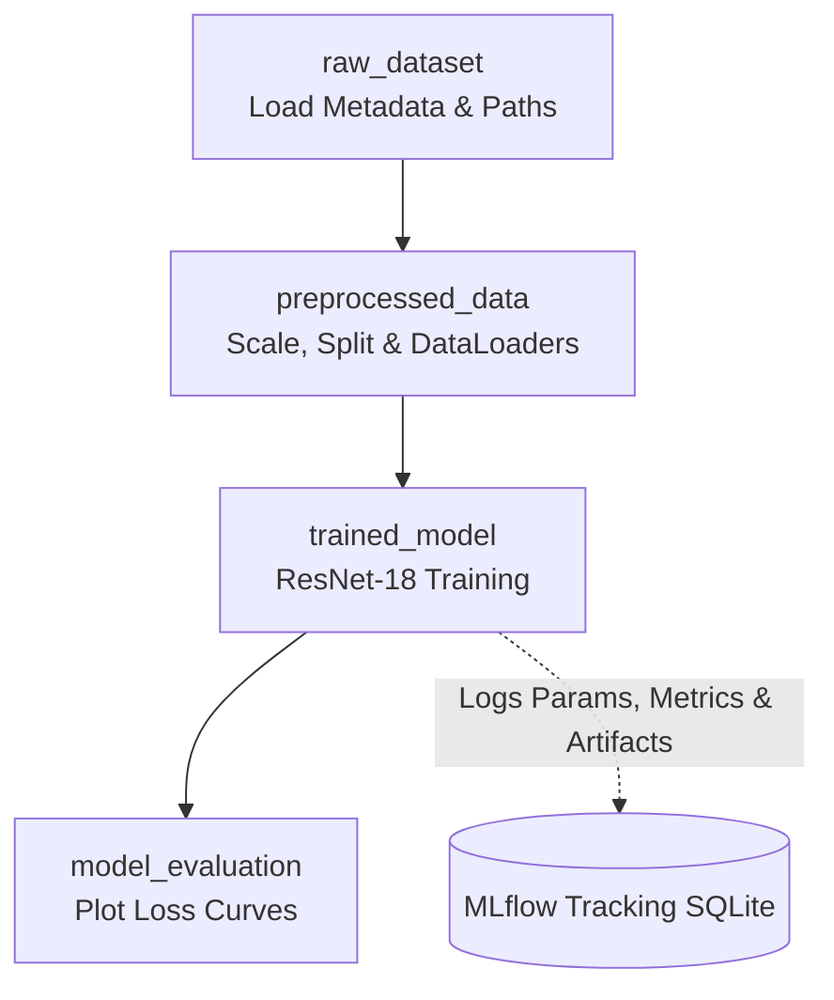
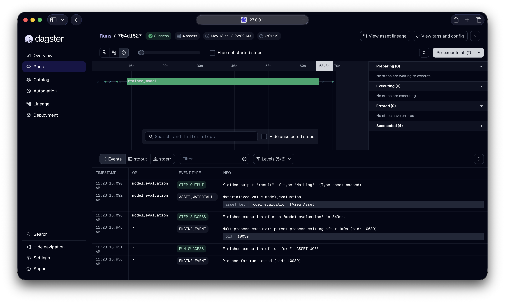
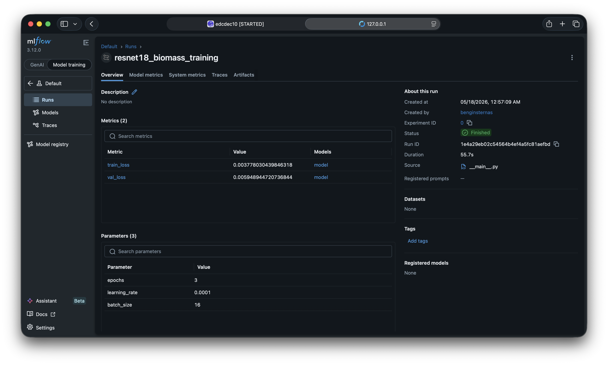
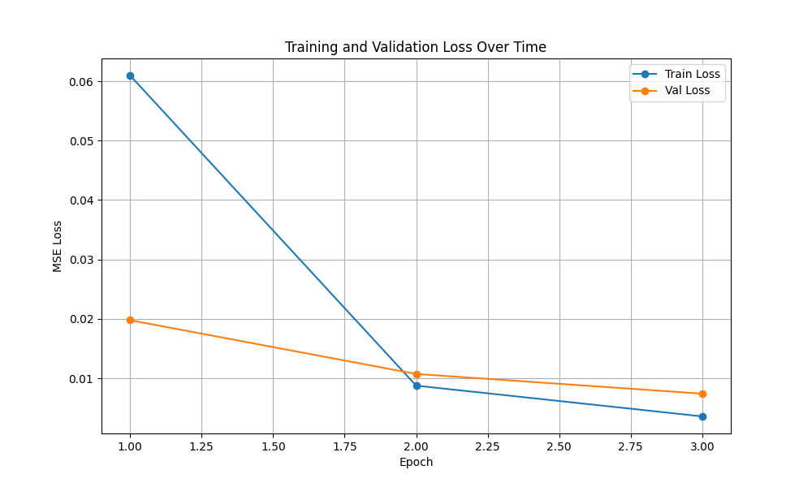

# MLOps Lab Block 2: ML Pipeline Automation with Dagster
## Plant Biomass Prediction - Group 2

## Overview
This project implements an automated ML pipeline for plant biomass prediction from top-down plant images. Building upon the manual PyTorch workflow from Praktikum 1, this version introduces **Dagster** for pipeline orchestration and **MLflow** for experiment tracking.

## 1. Pipeline Architecture
The workflow is divided into four main Dagster assets to ensure a reproducible and modular pipeline:

1. **`raw_dataset`**: Loads image paths and tabular metadata (`digital_biomass_labels.csv`/`.xlsx`) from disk and drops entries with missing labels.
2. **`preprocessed_data`**: Scales the targets to a range of [0, 1], creates an 80/20 train/validation split, applies ResNet-18 specific transformations, and builds PyTorch `DataLoader` objects.
3. **`trained_model`**: Trains a ResNet-18 regression model on the data. It utilizes **MLflow** to automatically track hyperparameters, log metrics per epoch, and save the trained model artifact.
4. **`model_evaluation`**: Consumes the loss histories from the training asset to generate and save training curves.

### Architecture Diagram


## 2. Dataset & Data Quality Context
- **Samples:** 4294 images
- **Target variable:** `fresh_weight_total`
- **Images:** `mlops_biomass_data/images_med_res`

**Key Findings:**
- **Target distribution:** Right-skewed with many lightweight (early-growth) plants.
- **Biomass vs. age:** Biomass increases with plant age (weekly measurements).
- **Data Quality:** Missing labels in `fresh_weight_total` are removed dynamically. Targets are scaled to [0, 1] by dividing by the max value to prevent unstable loss (NaN).

## 3. Technologies
- **Orchestration & Tracking:** Dagster, MLflow, dagster-mlflow
- **Machine Learning:** PyTorch, Torchvision, Scikit-learn
- **Data Handling & Viz:** Pandas, Matplotlib, Seaborn, Pillow

## 4. Results & Tracking
The pipeline successfully tracks all experiments via the integrated MLflow resource.

- **Tracked Parameters:** `epochs` (3), `learning_rate` (0.0001), `batch_size` (16)
- **Tracked Metrics:** `train_loss`, `val_loss` (logged at each epoch)
- **Model Artifact:** The PyTorch ResNet-18 model weights are saved directly into the MLflow SQLite database (`mlflow.db`).

### Dagster Orchestration (Successful Run)


### MLflow Experiment Tracking


### Training Curves

*Explanation: Train and validation loss decrease across epochs without divergence. Orchestrated by Dagster's `model_evaluation` asset.*

## 5. Setup Instructions
To set up the environment, Python 3 and a virtual environment are recommended.

```bash
# Clone the repository
git clone https://gitlab.nt.fh-koeln.de/gitlab/mlops/praktikum/mlops_2/MLOps_P2_2.git
cd MLOps_P2_2

# Create and activate a virtual environment
python3 -m venv .venv      # Windows: python -m venv .venv
source .venv/bin/activate  # Windows: .venv\Scripts\activate

# Install all required packages
pip3 install -r requirements.txt # Windows: pip install -r requirements.txt
```

## 6. Running the Pipeline
To execute the pipeline and view the experiments, use two terminal windows.

**Terminal 1: Start Dagster UI**
```bash
dagster dev -f dagster_pipeline.py
```
Open `http://localhost:3000` in your browser. Navigate to the "Lineage" tab and click "Materialize all" to run the complete pipeline.

**Terminal 2: Start MLflow UI**
```bash
mlflow ui --backend-store-uri sqlite:///mlflow.db
```
Open `http://localhost:5000` in your browser to view the logged experiments, parameters, metrics, and saved models.

## 7. Changes

Fix:

Fixed the Dagster pipeline runs not showing up on MLFlow


Improvements:

Configs added for different assets.
Plot added to Dagster


## Developers
- Bengin Sternas
- Joshua Sauter